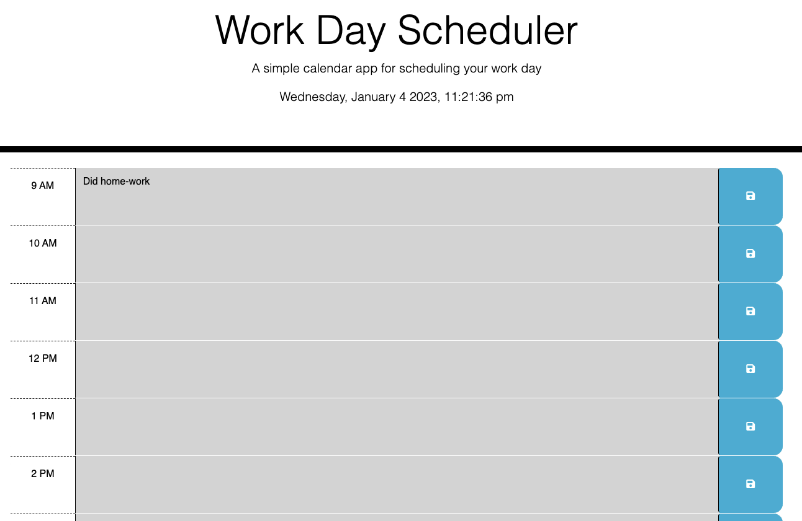

# Work Day Scheduler

This is a simple work day calendar application that allows a user to save events for each hour of the day by using the starter code provided.

## Installation

1. Download or clone repository
2. Open the main page (index.html) on your browser to view
3. Use a text editor to view all coding, Visual Studio Coding is recommended.

## Features

- HTML
- CSS
- Bootstrap
- jQuery
- dayjs

## Screenshot

## live page
